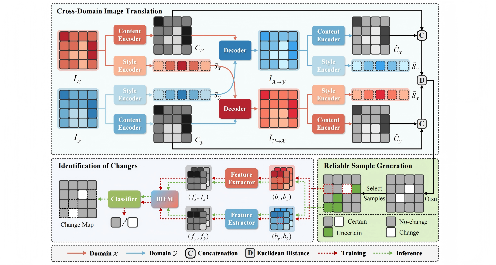

<div align="center">
<h2 align="center">Cross-Domain Difference Representation Learning for Unsupervised Heterogeneous Change Detection (TGRS 2025)</h2>

[**Full Paper**](https://ieeexplore.ieee.org/document/11059287) | [**Overview**](#overview) | [**Start CDRL**](#Start_CDRL) | [**Results**](#results) | [**Others**](#citation) 

</div>

## 📰Overview



**Fig. 1. Flowchart of the proposed CDRL framework.** 🔷Through **CITNet**, a high-quality DI can be obtained by computing the Euclidean distance between paired content features from the translated and target images with the same modality. 🟩Then, reliable samples are generated by segmenting the DI followed by **sample selection**. 🟣Based on knowledge transfer, these samples are fed into the **CDNet** embedded with DIFM to learn the concepts of changed and unchanged pixels, thereby assigning corresponding labels to uncertain samples and producing a final change map.

## 🙋Start_CDRL

### 1️⃣ Requirements

```
python==3.9.18
torch==2.3.0
torchvision==0.18.0
scikit-learn==1.4.2
numpy==1.26.4
opencv-python==4.9.0.80
```

### 2️⃣ Datasets

You can find the datasets we used at the following link:
 👉[**Datasets** (Shuguang/Texas/France/Guizhou/Mexico)](https://pan.baidu.com/s/1ZXhiQrmtoWuVRYAoDrLOaw?pwd=CDRL )

If you wish to use your own dataset, please organize your data in the following structure:

```
├── ./Data
   ├── /[Your Dataset Name]
      ├── data.mat  # if have
      ├── im1.bmp
      ├── im2.bmp
      └── reference.bmp
```

### 3️⃣ Training

Then simply run:

```
python CDRL_Main.py
```

## 📑Results

To facilitate reproduction and comparison, we also provide all the 🗂️[**Results**](https://pan.baidu.com/s/1S4_t6htNBtDi41Ei7qx5Ng?pwd=CDRL) of our core experiments, including change maps (CMs) and difference images (DIs).

## ✨Citation

If you find our work useful, please consider citing:

```
@article{CDRL2025,
  author={Zhan, Tao and Lan, Jie and Zhu, Yuanyuan and Dang, Qianlong and Gong, Maoguo},
  journal={IEEE Transactions on Geoscience and Remote Sensing}, 
  title={Cross-Domain Difference Representation Learning for Unsupervised Heterogeneous Change Detection}, 
  year={2025},
  volume={63},
  pages={1-17},
  doi={10.1109/TGRS.2025.3584073}
}
```
